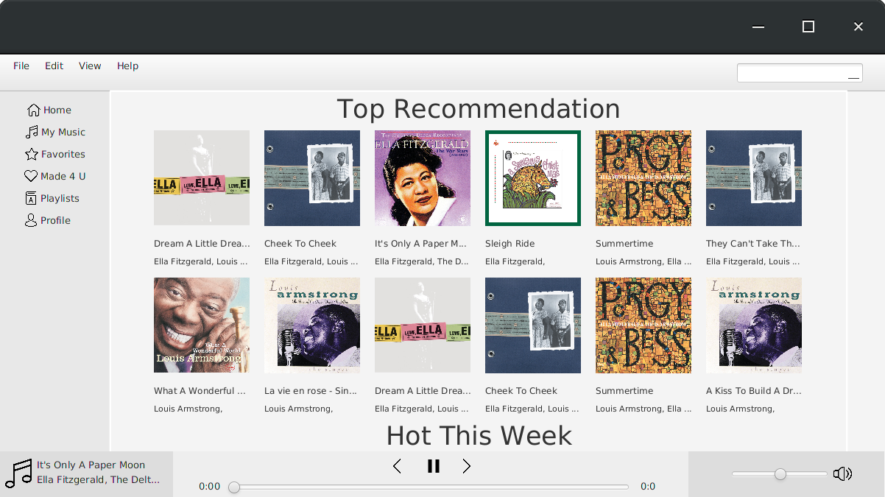

# Music Curator

#### Short Description:

The music recommender will be a program with a user GUI that takes in a user’s favorite musical artists/songs and provides the user with recommendations on other artists/albums/songs that they may like (including the ability to play a preview of the artist or song). It will also be able to accept user feedback on the suggestions and update recommendations based on the user’s feedback (ex: remove suggestions that the user does not like and other recommendations that are too similar to the disliked suggestion). 

#### Features:
* Search artist, artist attributes (lyrics, trivia, artist description)
* “Artists you may like” recommendation list
* “Albums you may like” recommendation list
* Song/artist audio preview/download (30 seconds)
* com.curator.models.User feedback for the recommendations (like/dislike)
* Updates recommendation list based on user feedback
* Removes suggestions they don’t like and any other artists who are too similar
If a user likes a suggestion, the recommendation list will update with more artists similar to the liked suggestion

### Running on Eclipse:
##### Cloning Repository
1. File -> Import... -> Git -> Projects from Git (with smart import) -> Clone URI
2. Under "Location" fields, set "URI": https://github.com/UPenn-CIT599/final-project-music-com.curator. Set "Host": `github.com`. Set "Repository Path": `/UPenn-CIT599/final-project-music-com.curator`
3. Under "Connection", set "Protocol": `https`. Under "Authentication", fill your github username and password. Click Next.
4. Select "master" branch. Next, select desired directory or use the default setting. 
5. Next, cloning begins and click "Finish" once completed.

##### Import Downloaded Project as Gradle Project
6. File -> Import... -> Gradle -> Existing Gradle Project -> Next
7. Select project root directory to be the path to final-project-music-curator folder. e.g. `/home/username/eclipse-workspace/final-project-music-curator` or `C:\Users\User\Documents\eclipse-workspace\final-project-music-curator`. Next.
8. Leave as default, i.e. Gradle Distribution set to Gradle wrapper, and leave other fields blank. Click Finish.

##### Run Task 
9. On Gradle Tasks bar at the bottom, MusicCurator -> application -> double-click on "run"

#### Team 71
* Isaac Longkutoy ([islong@seas.upenn.edu](mailto:islong@seas.upenn.edu)) 
* Luke Glover ([lcglover@seas.upenn.edu](mailto:lcglover@seas.upenn.edu))
* Meng Wang ([mw3131@seas.upenn.edu](mailto:mw3131@seas.upenn.edu))

