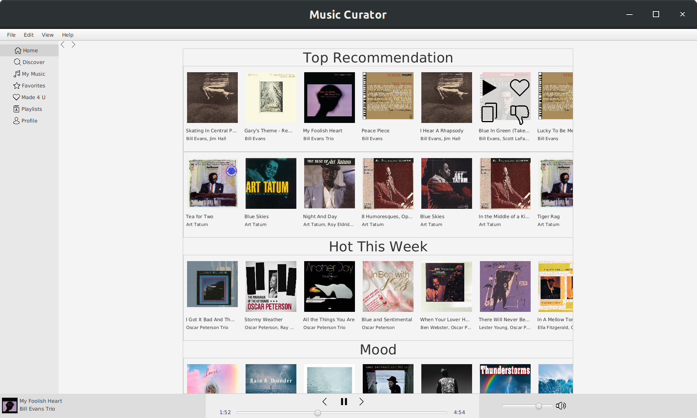

# Music Curator
Official Page: https://upenn-cit599.github.io/final-project-music-curator/

#### Short Description:
Music Curator is a smart music player that picks for you your next favorite tracks, albums, or artists based on your usage and preference.

#### Features:
* Curate special collections of artists, albums, and tracks you might like
* Search and discover artists, albums, and tracks  
* Play and download any track and any album by any artist
* Save your artists, albums, and tracks you like 
* Create custom playlist of your favorite tracks 
* Store user account and preference on the cloud 

### Running on Eclipse:
See video instruction on how to run on Eclipse: https://youtu.be/hzoyh4J6Ov0

##### Installing FFMPEG
This app requires FFMPEG to be configured in PATH to play music
1. On Mac, use Homebrew to install FFMPEG by running `brew install ffmpeg`
2. On Linux, use your default package manager, e.g. for debian `sudo apt-get install ffmpeg`

##### Cloning Repository
Open Eclipse and follow the following instructions

3. File -> Import... -> Git -> Projects from Git (with smart import) -> Clone URI
4. Under "Location" fields, set "URI": https://github.com/UPenn-CIT599/final-project-music-com.curator. Set "Host": `github.com`. Set "Repository Path": `/UPenn-CIT599/final-project-music-curator.git`
5. Under "Connection", set "Protocol": `https`. Under "Authentication", fill your github username and password. Click Next.
6. Select "master" branch. Next, select desired directory or use the default setting. 
7. Next, cloning begins and click "Finish" once completed.

##### Import Downloaded Project as Gradle Project
8. File -> Import... -> Gradle -> Existing Gradle Project -> Next
9. Select project root directory to be the path to final-project-music-curator folder. e.g. `/home/username/eclipse-workspace/final-project-music-curator` or `C:\Users\User\Documents\eclipse-workspace\final-project-music-curator`. Next.
10. Leave as default, i.e. Gradle Distribution set to Gradle wrapper, and leave other fields blank. Click Finish.

##### Configuring FFMPEG path
Once the project is cloned and FFmpeg installed,

11. On the terminal, type  `which ffmpeg` to get the path to ffmpeg
12. Navigate to src/main/java/Main.java.
13. At the beginning of `Main.start()` method, make sure `YoutubeTools.setFFMPEGpath("PATH_TO_FFMPEG_FOLDER");` is set to the same folder from running `which ffmpeg`. 
On Mac, it's usually `/usr/local/bin/` (default), and on Linux `/usr/bin/`. 

##### Run Task 
14. On Gradle Tasks bar at the bottom, MusicCurator -> application -> double-click on "run"

#### User Guide
First time user? Please see [User Guide](docs/guides.md).

#### Team 71
* Isaac Longkutoy ([islong@seas.upenn.edu](mailto:islong@seas.upenn.edu)) 
* Luke Glover ([lcglover@seas.upenn.edu](mailto:lcglover@seas.upenn.edu))
* Meng Wang ([mw3131@seas.upenn.edu](mailto:mw3131@seas.upenn.edu))

