# Instructions 

# User Guide to Music Curator 

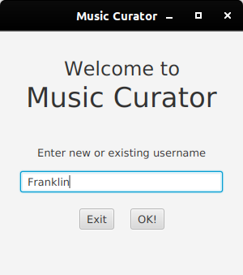

On program launch, a welcome screen will appear.
You can enter a new or existing user name. If your username exists in our record, you'll be directed the home screen.
If you are a new user, the following screen will appear. 

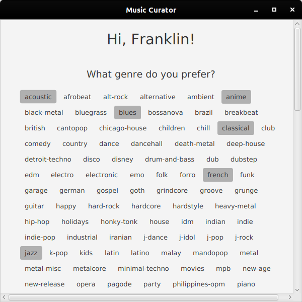

Here you can tell us more about your musical preference.
You can pick several genres you like.

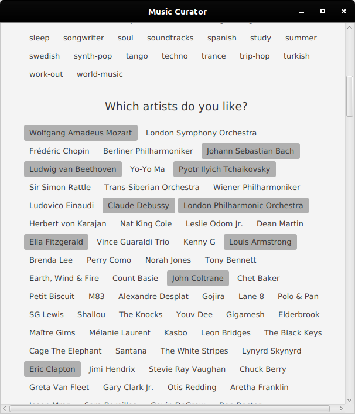
After you pick the genres, some of the top artists of that genre will show up.
You can pick your some of the artists you like here as well.
Every time you pick an artist, a related artists will also be displayed as you choose. 

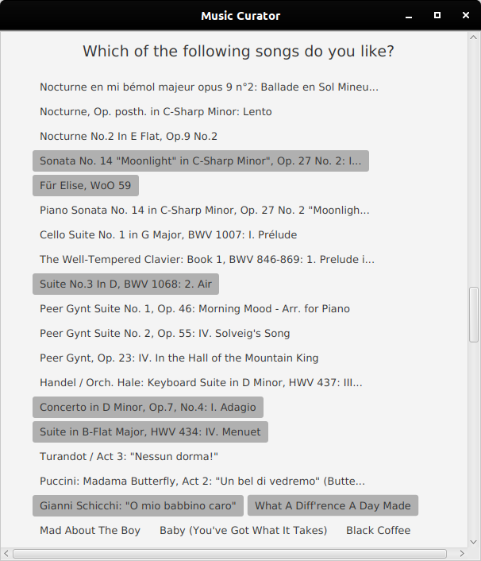
As you pick the artists, Music Curator will get some of the top songs by that artists, and some related songs.
You can choose the songs you like here. 
After you finished, click on the "Curate Music for Me" at the bottom.
The recommendation algorithm will curate a collection of tracks, artists, and albums
that you might like, based on the items you picked at this stage.
The algorithm may take time up to 1 minute and will bring you to the home screen upon completion.

The home screen displays the recommended track, artists, and albums will be displayed here.
If you hover your mouse on one of the panes, some control buttons will appear. 
You can click play to let the program downloads and play the music. 
Click heart to like an item and save it to My Music, 
There's an add to playlist button (but you need to create it first in Playlist page). 

If you hover on the track/album/artist name, it will get underlined, and upon click, will bring you to the artist/track/album page of that item.
For example, this is the page for Michael Buble.

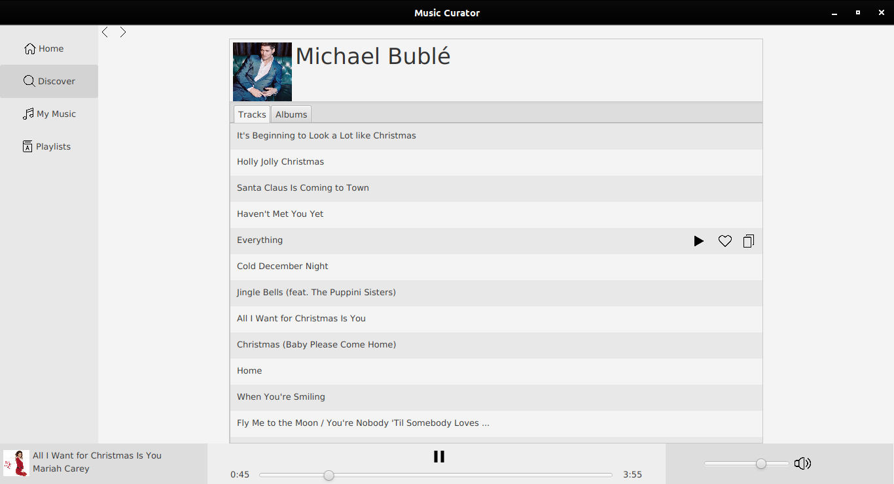
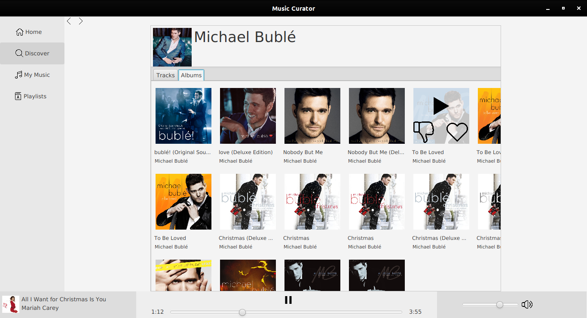
In the artist page, there are Track tabs, which will list the most popular tracks by the artist, 
and Album tab, which also displays the artist's top albums.

If you clicked on the album name, the album page shows up.
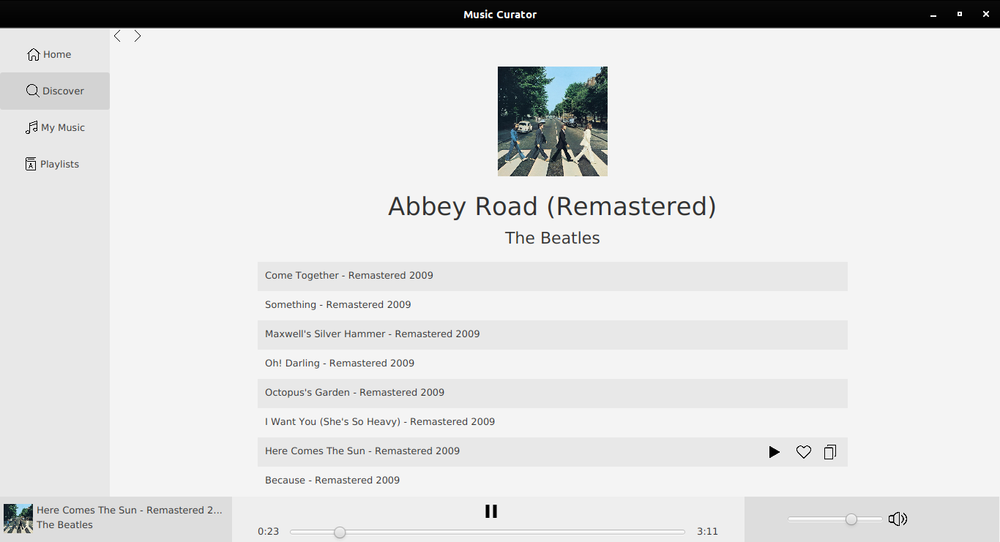
You can always go back to the previous page using the back button at the top left corner. 
Once you clicked that, you can also return to the page you were before by clicking the forward button (just next to back button). 

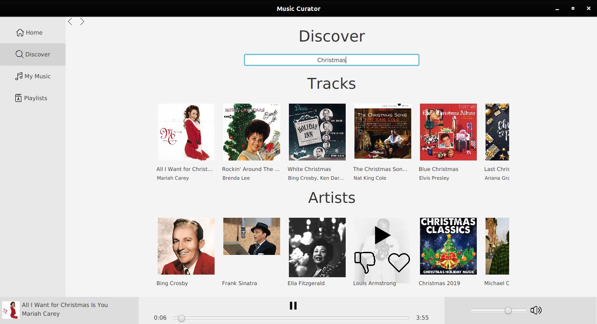
On the left, if you click on Discover button, the Discover page will shows up.
There will be a field where you can query tracks, artists, or albums.

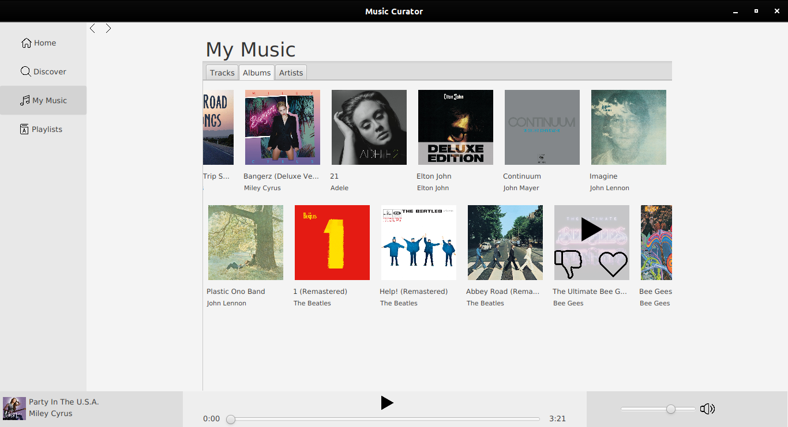
The My Music page will store the tracks, artists, and albums that you liked on the initial preference page
as well as items you liked (by clicking the heart button) while using the application. 
Clicking dislike will remove the item from your list of favorite artists/albums.

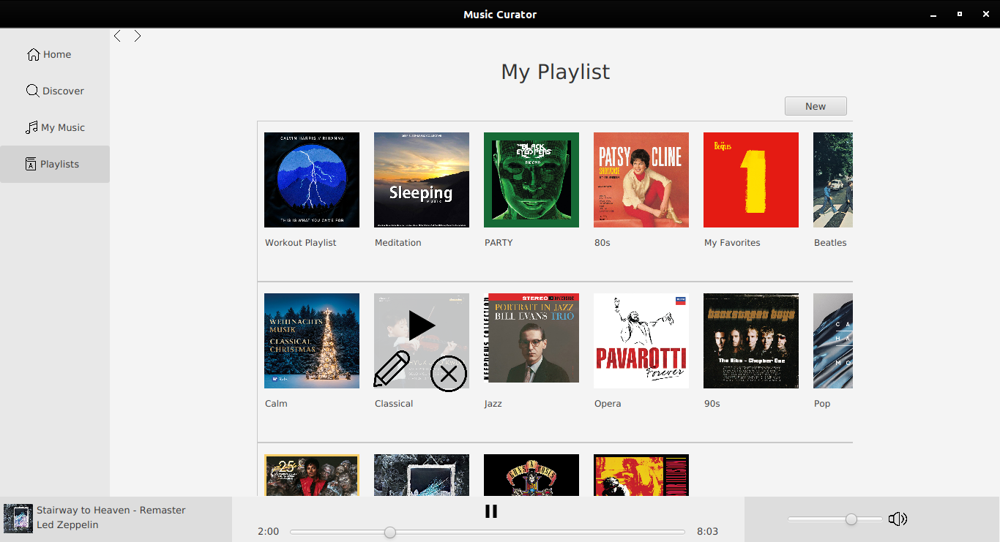
In the Playlist page, you can create a new playlist by clicking the New button at the top right corner, and a New Playlist will be created for you.
You can add, remove, play, and rename playlist. You can add tracks you like in the other pages to the playlist by clicking the 
add to playlist icon when you hover on the tracks.

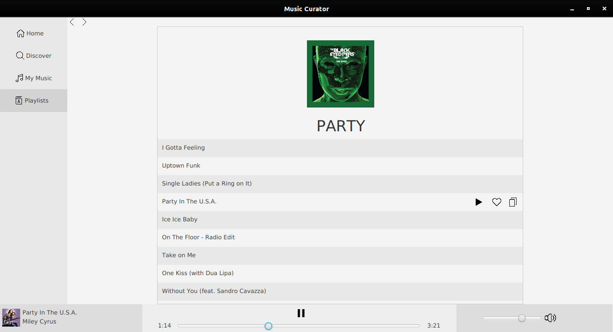
You can click the playlist name to show the list of all tracks contained within that playlist;

